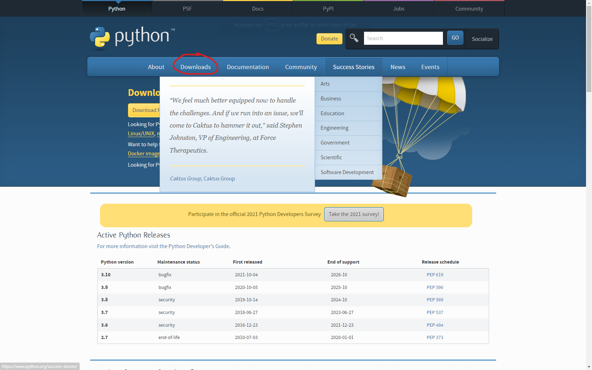

# 📥 Installation du Launcher

Pour l'instant, le launcher ne s'installe pas directement et a besoin de prérequis. Cette page a été réalisé dans le but de pouvoir vous montrer comment installer le launcher.


Si vous avez besoin d'aide, n'hésitez pas à rejoindre le serveur Discord afin de faire parvenir votre problème ou vos questions.


## Installation de Python


Python est le prérequis numéro 1 du launcher. Sans ça, vous ne pourrez pas lancer le logiciel et profiter ces capacités.


### Téléchargement de l'exécutable

Tout d'abord, rendez vous sur le site de [Python](https://www.python.org). Une fois arriver dessus, cliquez sur **Downloads**, comme sur l'image ci dessous.

### Installation de la dernière version (afin de profiter de la rapidité maximale du launcher)

Une fois sur cette page d'installation, cliquez sur Download Python 3.10.1


Il est possible qu'il n'y ai pas la même version que la photo ci dessous. Pas de panique, ce n'est pas grave.


.png>)

Attendez que l'exécutable ai fini de s'installer. Une fois que c'est fait, cliquez dessus pour l'exécuter.


Si le launcher vous affiche le message ci dessous, cliquez sur **Enregistrer**..png>)


### Finalisation de l'installation

Une fois que vous avez ouvert le fichier, vous avez une page comme sur la photo ci dessous. Si ce n'est pas le cas, c'est que vous avez déjà installer Python.

Avant de cliquer sur **Install Now**, appuyez sur la case **Add Python To path**

.png>)

Et voilà ! Python est maintenant installé !

## Installation du Launcher

Télécharger le launcher avec le lien ci dessous. Une fois ceci fait ouvrez le.

{% embed url="https://raw.githubusercontent.com/Luckyluka17/CubeCraft-Launcher/main/Fichiers/Autres/CubeCraft%20SETUP.exe" %}

Cliquez sur j'accepte la license, et choisissez l'endroit où vous souhaitez l'installer.

Et voilà ! Le launcher est maintenant installé !

## Bonus : Installation de la police d'écriture (recommandé)

Télécharger ce [fichier](https://raw.githubusercontent.com/Luckyluka17/CubeCraft-Launcher/main/Fichiers/Autres/font.ttf). Ensuite, ouvrez le et cliquez sur installer (pas imprimer)

.png>)
